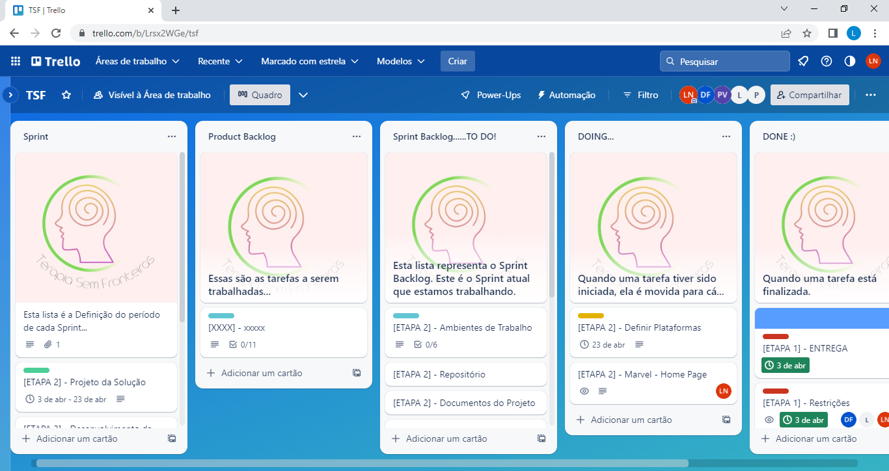

# Metodologia

As definições ferramentais utilizadas para o desenvolvimento e a manutenção dos códigos, bem como, as tarefas e o gerenciamento desse projeto serão mencionados a seguir:

## Relação de Ambiente de Trabalho
| Ambiente| Plataforma | Link de Acesso |
|---------|------------|----------------|
| Repositório de código fonte | GitHub |[Github](https://github.com/ICEI-PUC-Minas-PMV-ADS/pmv-ads-2023-1-e1-proj-web-t7-tsf)|
| Documento do Projeto | GitHub| [Github](https://github.com/ICEI-PUC-Minas-PMV-ADS/pmv-ads-2023-1-e1-proj-web-t7-tsf)|
| Projeto de Interface e Wireframes | MarvelApp | [Marvel](https://marvelapp.com/project/6697348)|
| Gerenciamento do Projeto | Trello | [Trello](https://trello.com/b/Lrsx2WGe/tsf)

## Gerenciamento do Projeto
A equipe utilizará de Processos Ágeis, tendo escolhido o Scrum como base para definição do processo de desenvolvimento.
Organizando-se da seguinte forma:

|Funções|Colaborador|
|---------|------------|
| Scrum Master:|Pedro Ferreira|
| Product Owner:|Larissa Ferreira|
| Equipe de Desenvolvimento:|Douglas Ferreira|
| |Larissa Ferreira|
| |Liana Nagasawa|
| |Pedro Ferreira|
| Equipe de Designer:|Douglas Ferreira|
||Liana Nagasawa|

Para organização e distribuição das tarefas do projeto, a equipe está utilizando o Trello.
O quadro TSF na ferramenta de gerenciamento de projetos está disponível através da [Trello](https://trello.com/b/Lrsx2WGe/tsf) e é apresentado, no estado atual, na Figura 1.

Tela Trello utilizada pelo grupo
