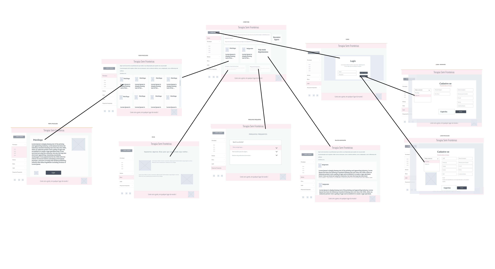
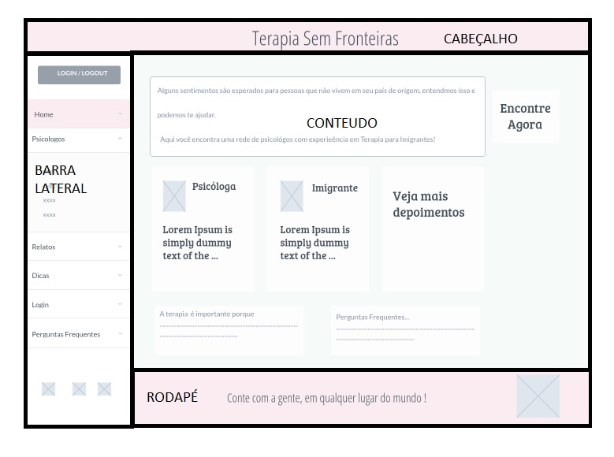
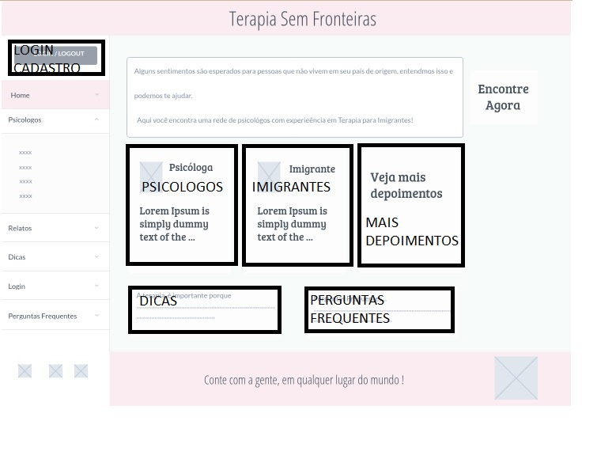
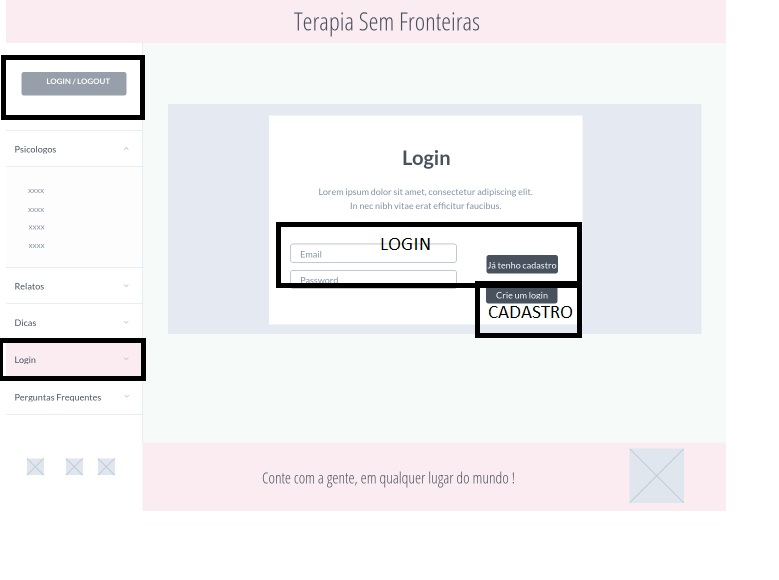
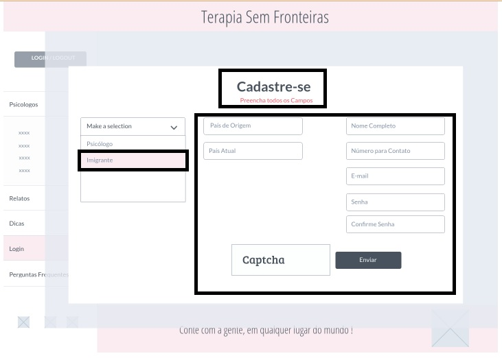
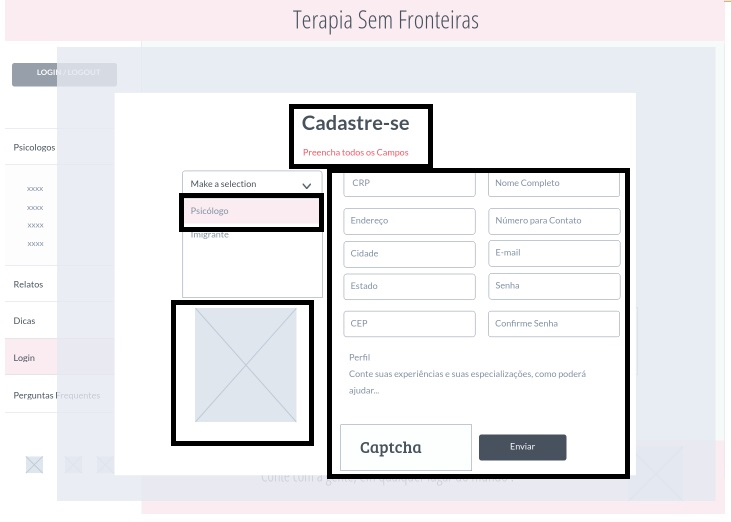
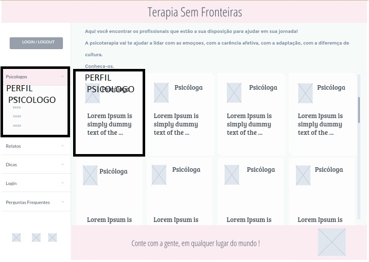
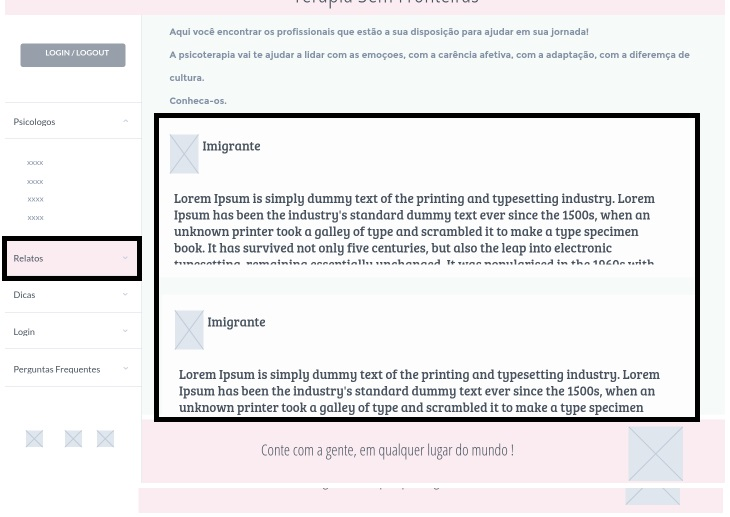

# Projeto de Interface

 Nesse projeto, se estabelece o foco em questões como agilidade, acessibilidade e usabilidade. 

## Fluxo do Usuário
 
 O diagrama apresentado na Figura 2, mostra o fluxo de interação do usuário pelas telas do sistema. Cada uma das telas deste fluxo é detalhada na seção de Wireframes que se segue. Para visualizar por completo, acesse [Marvel](https://marvelapp.com/project/6697348).
 
Diagrama - Figura 2

## Wireframes
Conforme fluxo de telas do projeto, apresentado no item anterior, as telas do sistema são apresentadas em detalhes nos itens que se seguem. As telas do sistema apresentam uma estrutura comum que é apresentada na Figura 2. Nesta estrutura, existem 3 grandes blocos, descritos a seguir. São eles:

●	Cabeçalho - local onde são dispostos elementos fixos de identidade, como o nome do projeto: Terapia Sem Fronteiras;

●	Rodapé - apresenta o conteúdo com slogan e logo;

●	Barra lateral - apresenta os elementos de navegação secundária, geralmente associados aos elementos do bloco de conteúdo. O bloco da Barra Lateral traz todos os elementos citados acima, em formato Menu.

Estrutura do Site - Figura 3
 
## Telas

**HomePage**

A tela de home-page mostra destaques dos conteúdos oferecidos pelo site. 
Com base na estrutura padrão, o bloco de Conteúdo traz os cards em destaque (Perfis de Psicólogos, relatos de imigrantes, dicas, perguntas frequentes, área de login, etc).

Home Page - Figura 4

**Tela Login**

A tela Login dá opção de entrar na conta ou criar um novo cadastro.

Login - Figura 5

**Tela Cadastro**

A tela de Cadastro apresenta opção para dois perfis:

●	**Imigrantes**, realizando o cadastro mais simples, com pouca exigência de informações.

●	**Psicólogos**, realizando o cadastro mais completo, com mais riqueza de informações. 

Cadastro Imigrantes - Figura 6

Cadastro Psicólogo - Figura 7

**Tela Psicologos**

A tela Psicólogos apresenta a visualização clicável de todos os perfis cadastrados para que os imigrantes possam conhecê-los e escolher:

Psicologo - Figura 8

**Tela Perfil Psicólogo**
A tela Perfil Psicólogo apresenta a visualização mais detalhada de um perfil escolhido, com opção de entrar em contato via WhatsApp ou mostrar o número de telefone.

Perfil Psicologo - Figura 9

**Tela Relatos**

A tela Relatos apresenta campos com relatos de imigrantes que deixaram uma mensagem ou uma dica para quem está buscando ajuda.

Relatos - Figura 10

**Tela Perguntas Frequentes**

A tela Perguntas Frequentes apresenta uma série de perguntas e respostas para ajudar os usuários na usabilidade do site. Haverá um formulário para contato em caso de dúvidas.

Perguntas Frequentes - Figura 11
