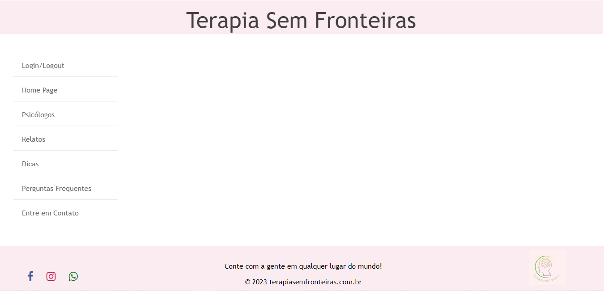

# Template padrão do site

Abaixo será apresentado o layout padrão do site (HTML e CSS) que será utilizado em todas as páginas com a definição de identidade visual, aspectos de responsividade e iconografia:

Template Site TSF

O template criado está disponível no site       e é composto pelos seguintes layouts:

1. Tela Principal
2. Tela de Login
3. Tela para Cadastro de Psicólogos
4. Tela para Cadastro de Imigrantes
5. Tela de Psicólogos
6. Tela dos Relatos de Imigrantes
7. Telas Contendo Dicas para Imigrantes 
8. Tela de Perguntas Frequentes
9. Tela de Entre em contato

## Tela principal

Tela que abrange todas as visualizações iniciais, a lista de navegação do site, bem como rodapé.

Home Page TSF
