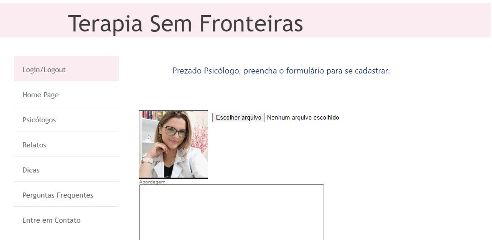
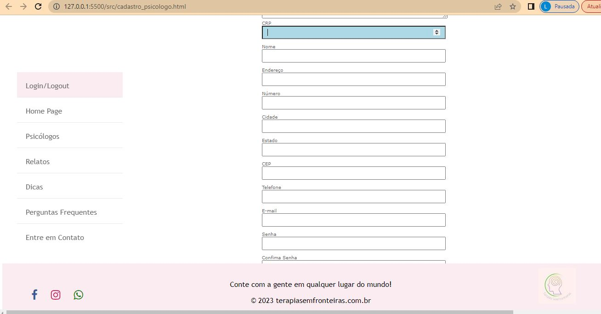
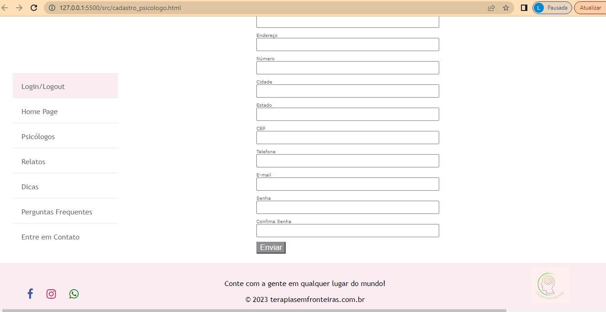
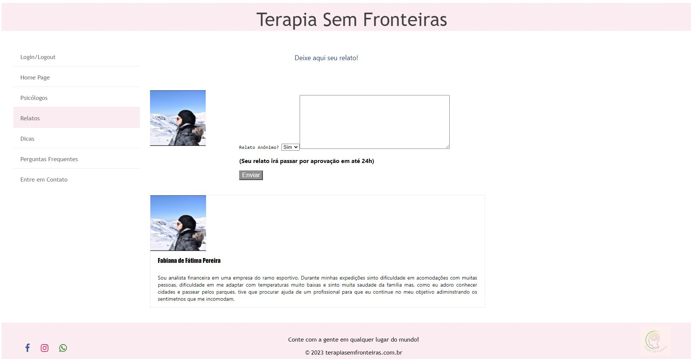

# Programação de Funcionalidades

As telas desenvolvidas para cada uma das funcionalidades do sistema serão apresentadas nessa seção. 

## Página Inicial com cards (RF01 - RF05)

A Home Page apresenta 04 cards com destaque para: Psicólogos Disponíveis, Relatos de Imigrantes, Dicas para Imigrantes e Perguntas Frequentes. 
Na Home Page está claro o propósito do site: "Certos sentimentos inesperados surgem para algumas pessoas que estão fora de seu país de origem, entendemos isso e podemos ajudar. Aqui você encontrará uma rede de psicólogos com experiência em Terapia para Imigrantes."

 Home Page 

### Requisitos Atendidos
1. RF-01
2. RF-05

### Artefatos da funcionalidade
1. index.html
2. Style.css
3. card_profissionais.jpg
4. card_relatos.jpg
5. card_dicas.jpg
6. card_perguntasfrequentes.jpg

### Estrutura de Dados

            
            
Profissionais

            
Maria Cristina Bizotti

            
 Atuo na abordagem da TCC - Terapia Cognitivo Comportamental. Já realizei muitos
                trabalhos
                voluntários,
                Busco promover qualidade de vida, bem-estar psicológico e emocional para meus pacientes, minha maior
                alegria é ver os resultados que a
                terapia proporciona na vida dos pacientes. 

            <a class="cards_saibamais" href="psicologos.html">Ver perfil completo...</a>
        

        

            
            
Relatos

            
(anônimo)

            
Durante minhas expedições senti dificuldade em acomodações com muitas pessoas,
                dificuldade em me
                adaptar com temperaturas muito baixas e senti muita saudade da família mas, adorava andar à toa para
                conhecer cidades e passear pelos parques. Estou sempre em busca de conhecer novas pessoas, culturas
                e novos lugares.

            <a class="cards_saibamais" href="relatos.html">Mais Relatos...</a>
        

        

            
            
Dicas

            
Como administrar a saudade da familia?

            
Crie uma rotina, encontre um local que tenha algo familiar e evite o ócio...

            <a class="cards_saibamais" href="dicas.html">Veja mais dicas...</a>
        

        

            
            
Perguntas Frequentes

            
Por qual plataforma serão feitas as sessões?

            
Após entrar em contato com o psicólogo, o profissional te enviará um link com a
                plataforma a ser
                utilizada para as sessões.

            <a class="cards_saibamais" href="perguntas_frequentes.html">Tenho outras dúvidas...</a>
        

### Instruções de Acesso
1. Abra um navegador de internet e informe a seguinte URL: http/;
2. A Home Page possui os 04 cards da primeira funcionalidade.

## Página de Cadastro de Psicólogos (RF02)
A Página Cadastro Psicólogos apresenta um formulário requerendo informações como E-mail, CRP, Telefone, Abordagem. 

 Formulario Cadastro Psicologo
 Formulario Cadastro Psicologo
 Formulario Cadastro Psicologo

### Requisitos Atendidos
1.RF-02

### Artefatos da funcionalidade
1. cadastro_psicologo.html
2. Style.css

### Estrutura de Dados

                
 Prezado Psicólogo, preencha o formulário para se cadastrar. 

            

            

                <form action="/cadastro_psicologos" method="post">

                    
                    <input type="file" name="" id="img_cadastro">

                    <label for="msg">Abordagem</label>
                    <textarea id="msg"></textarea required >

                    <label for="crp">CRP</label>
                    <input type="number" id="crp" required />

                    <label for="nome">Nome</label>
                    <input type="text" id="nome" required />

                    <label for="endereco">Endereço</label>
                    <input type="text" id="endereco" />

                    <label for="number">Número</label>
                    <input type="number" id="numero" />

                    <label for="cidade">Cidade</label>
                    <input type="text" id="cidade" />

                    <label for="estado">Estado</label>
                    <input type="text" id="estado" />

                    <label for="cep">CEP</label>
                    <input type="number" id="cep" />

                    <label for="tel">Telefone</label>
                    <input type="number" id="tel" required />

                    <label for="email">E-mail</label>
                    <input type="email" id="email" inputmode="email" required  />

                    <label for="senha">Senha</label>
                    <input type="senha" id="senha" />

                    <label for="senha">Confima Senha</label>
                    <input type="senha" id="confisenha" />

                    

                        <button onclick="adicionarPsicologo()"  type="submit">Enviar</button>
                    

                </form>

            

### Instruções de Acesso
1. Abra um navegador de internet e informe a seguinte URL: http/;
2. A Pagina de Cadastro para Psicólogos possui um formulário para cadastro de Psicólogos.

## Página de Cadastro de Pacientes (Imigrantes) (RF03)
A Página Cadastro de Pacientes (Imigrantes) apresenta um formulário para cadastrar formas de contato.

 Formulario Cadastro Imigrante

### Requisitos Atendidos
1. RF-03

### Artefatos da funcionalidade
1. cadastro_imigrante.html
2. Style.css

### Estrutura de Dados

                    <form>

                        <input type="file" name="" id="btn">
                        <label for="nome">Nome</label>
                        <input type="text" id="nome" />

                        <label for="pais">País de Origem</label>
                        <input type="text" id="paisorigem" />

                        <label for="pais">País de Atual</label>
                        <input type="text" id="paisatual" />

                        <label for="tel">Telefone</label>
                        <input type="number" id="tel" required />

                        <label for="email">E-mail</label>
                        <input type="email" id="email" inputmode="email" required />

                        <label for="senha">Senha</label>
                        <input type="password" id="senha" />

                        <label for="senha">Confima Senha</label>
                        <input type="password" id="confsenha" />

                        

                            <button onclick="adicionarImigrante()" type="submit">Enviar</button>
                        

### Instruções de Acesso
1. Abra um navegador de internet e informe a seguinte URL: http/;
2. A Página de Cadastro para Imigrantes possui um formulário para cadastro de Pacientes.

## Página de Relatos  (RF06 - RF07)
A Página de Relatos dos Imigrantes apresenta uma opção para que usuários possam relatar anonimamente ou não.

 Pagina de Relatos
### Requisitos Atendidos
1. RF-06

### Artefatos da funcionalidade
1. relatos.html
2. Style.css

### Estrutura de Dados

<aside class="aside">
        

            
 Deixe aqui seu relato! 

        

        

            
        

        

            <form>
                

                    
Relato Anônimo?
                    <select id="anonimo">
                        <option value="sim">Sim</option>
                        <option value="nao">Não</option>
                    

                

                <label for="msg">Seu Relato</label>
                <textarea id="msgrelato"></textarea>
                
(Seu relato irá passar por aprovação em até 24h)

                <button onclick="adicionarRelatos()" type="submit">Enviar</button>
            </form>
        

        
     
        

    </aside>

### Instruções de Acesso
1. Abra um navegador de internet e informe a seguinte URL: http/;
2. A Página de Relatos possui todos os relatos enviados pelos usuários que foram previamente aprovados. E há opção de relatar anonimamente. 

## Página de Suporte - Entre em Contato  (RF08)
A Página Entre em Contato possui formulário para envio de dúvidas, sugestões e reclamações, além de informar um e-mail para suporte. 

### Requisitos Atendidos
1. RF-08

### Artefatos da funcionalidade
1. entre_em_contato.html
2. Style.css

### Estrutura de Dados

            <form>

                <label for="nome">Nome</label>
                <input type="text" id="nome" />

                <label for="tel">Telefone</label>
                <input type="number" id="tel" required />

                <label for="email">E-mail</label>
                <input type="email" id="email" inputmode="email" required />
              
                <label for="msg">Escreva sua mensagem:</label>
                <textarea id="msgcontato"></textarea>
                
Entraremos em contato o mais breve possível

                <button onclick="adicionarContato()" type="submit">Enviar</button>
            

### Instruções de Acesso
1. Abra um navegador de internet e informe a seguinte URL: http/;
2. Na Página Entre em Contato, é possível fazer contato através de um formulário
3. A página Entre em Contato informa um e-mail para contato com área de suporte
