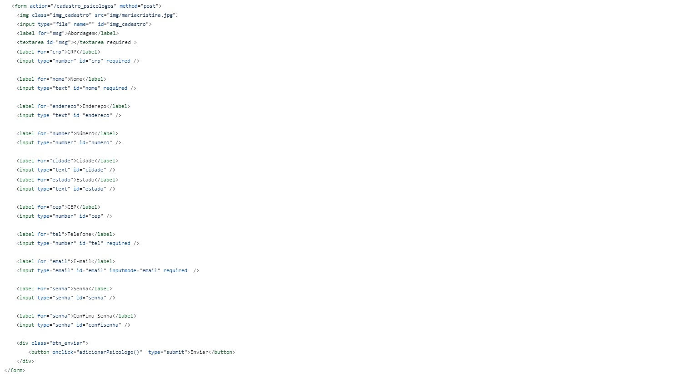
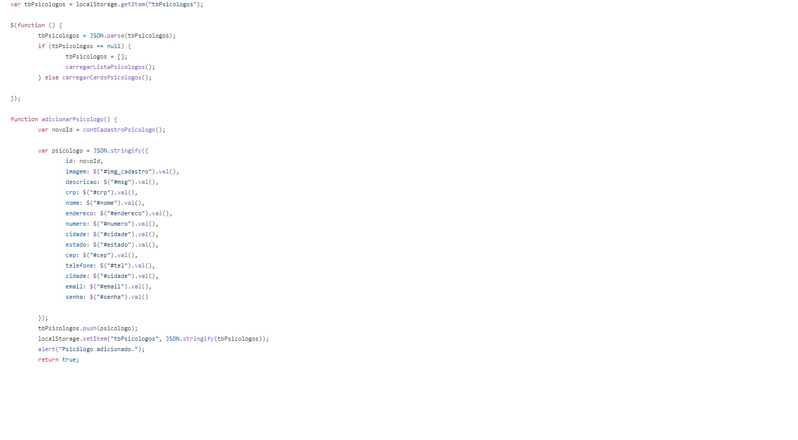
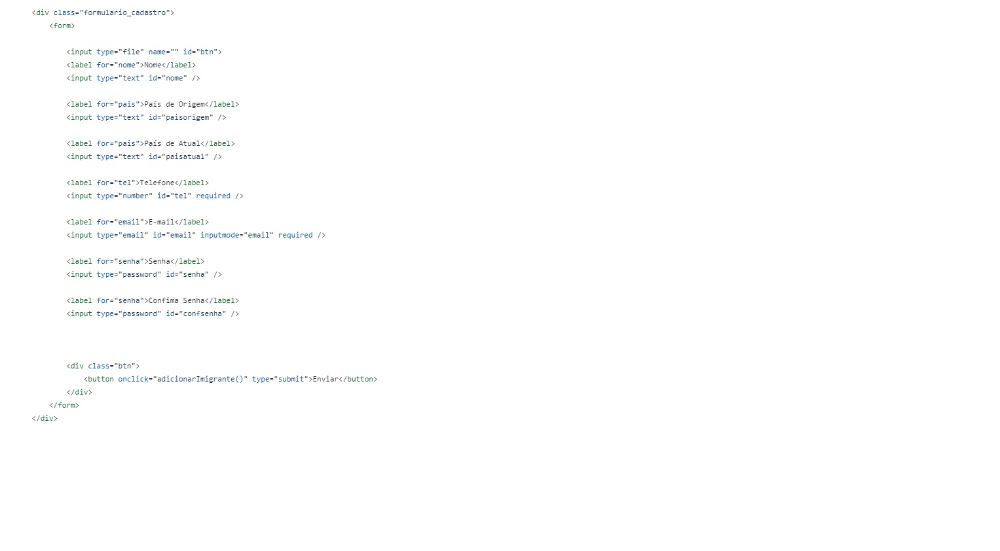
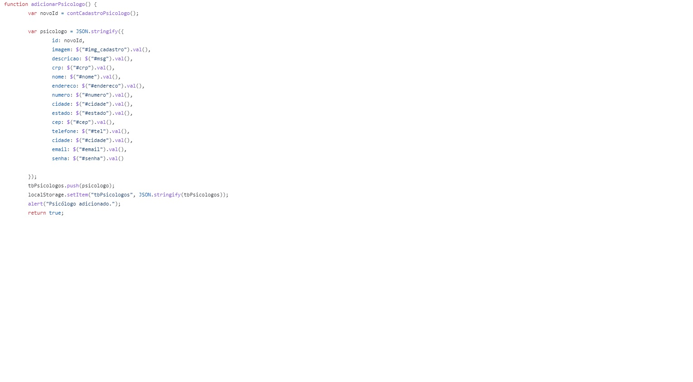
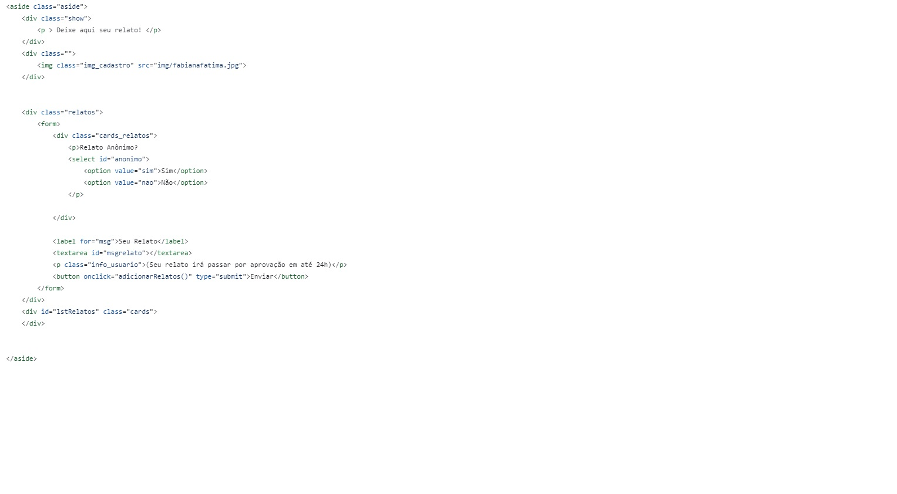
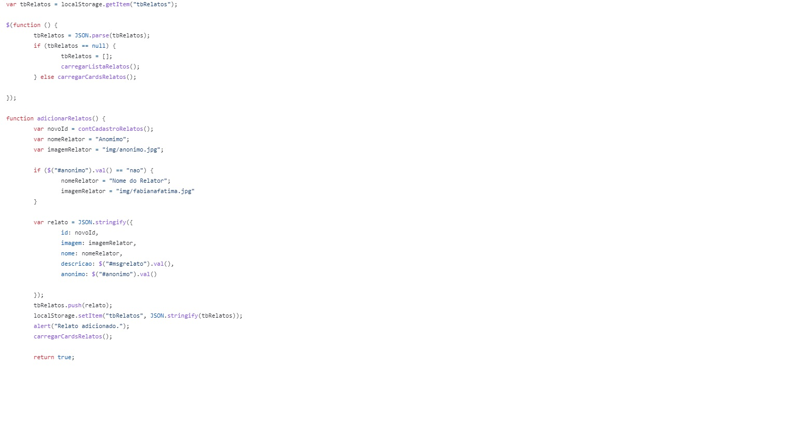

# Programação de Funcionalidades

As telas desenvolvidas para cada uma das funcionalidades do sistema serão apresentadas nessa seção. 

## Página Inicial com cards (RF01 - RF05)

A Home Page apresenta 04 cards com destaque para: Psicólogos Disponíveis, Relatos de Imigrantes, Dicas para Imigrantes e Perguntas Frequentes. 
Na Home Page está claro o propósito do site: "Certos sentimentos inesperados surgem para algumas pessoas que estão fora de seu país de origem, entendemos isso e podemos ajudar. Aqui você encontrará uma rede de psicólogos com experiência em Terapia para Imigrantes."

 Home Page 

### Requisitos Atendidos
1. RF-01
2. RF-05

### Artefatos da funcionalidade
1. index.html
2. Style.css
3. script_TSF.js
4. card_relatos.jpg
5. card_dicas.jpg
6. card_perguntasfrequentes.jpg
7. card_profissionais.jpg

### Estrutura de Dados

### Instruções de Acesso
1. Abra um navegador de internet e informe a seguinte URL: [http://terapiasemfronteiras.net](http://terapiasemfronteiras.net)
2. A Home Page possui os 04 cards da primeira funcionalidade.

## Página de Cadastro de Psicólogos (RF02)
A Página Cadastro Psicólogos apresenta um formulário requerendo informações como E-mail, CRP, Telefone, Abordagem. 

 Formulario Cadastro Psicologo
 Formulario Cadastro Psicologo
 Formulario Cadastro Psicologo

### Requisitos Atendidos
1.RF-02

### Artefatos da funcionalidade
1. cadastro_psicologo.html
2. Style.css
3. script_TSF.js

### Estrutura de Dados

### Instruções de Acesso
1. Abra um navegador de internet e informe a seguinte URL: [http://terapiasemfronteiras.net](http://terapiasemfronteiras.net/src/cadastro_psicologo.html)
2. A Pagina de Cadastro para Psicólogos possui um formulário para cadastro de Psicólogos.

## Página de Cadastro de Pacientes (Imigrantes) (RF03)
A Página Cadastro de Pacientes (Imigrantes) apresenta um formulário para cadastrar formas de contato.

 Formulario Cadastro Imigrante

### Requisitos Atendidos
1. RF-03

### Artefatos da funcionalidade
1. cadastro_imigrante.html
2. Style.css
3. script_TSF.js

### Estrutura de Dados

### Instruções de Acesso
1. Abra um navegador de internet e informe a seguinte URL: [http://terapiasemfronteiras.net](http://terapiasemfronteiras.net/src/cadastro_imigrante.html)
2. A Página de Cadastro para Imigrantes possui um formulário para cadastro de Pacientes.

## Página de Relatos  (RF06 - RF07)
A Página de Relatos dos Imigrantes apresenta uma opção para que usuários possam relatar anonimamente ou não.

 Pagina de Relatos

### Requisitos Atendidos
1. RF-06
2. RF-07

### Artefatos da funcionalidade
1. relatos.html
2. Style.css
3. script_TSF.js

### Estrutura de Dados

### Instruções de Acesso
1. Abra um navegador de internet e informe a seguinte URL: [http://terapiasemfronteiras.net](http://terapiasemfronteiras.net/src/relatos.html)
2. A Página de Relatos possui todos os relatos enviados pelos usuários que foram previamente aprovados. E há opção de relatar anonimamente. 

## Página de Suporte - Entre em Contato  (RF08)
A Página Entre em Contato possui formulário para envio de dúvidas, sugestões e reclamações, além de informar um e-mail para suporte. 

### Requisitos Atendidos
1. RF-08

### Artefatos da funcionalidade
1. entre_em_contato.html
2. Style.css
3. script_TSF.js

### Estrutura de Dados

### Instruções de Acesso
1. Abra um navegador de internet e informe a seguinte URL: [http://terapiasemfronteiras.net](http://terapiasemfronteiras.net/src/entre_em_contato.html)
2. Na Página Entre em Contato, é possível fazer contato através de um formulário
