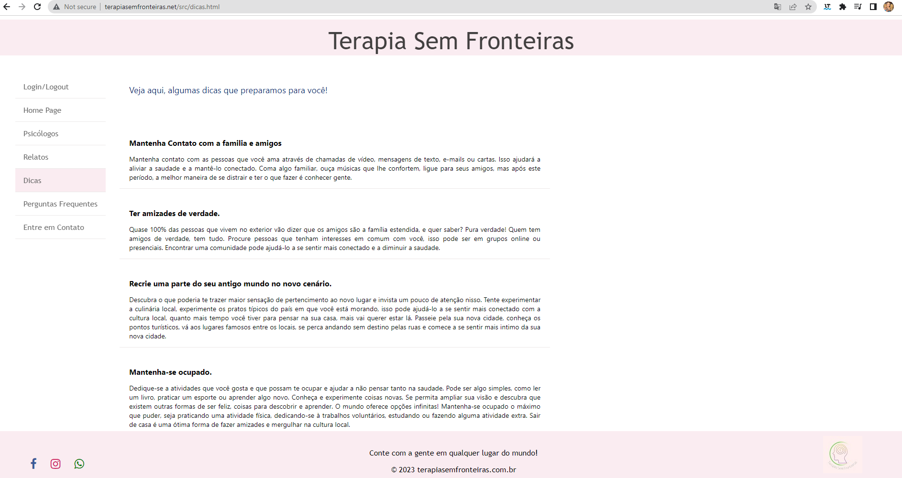
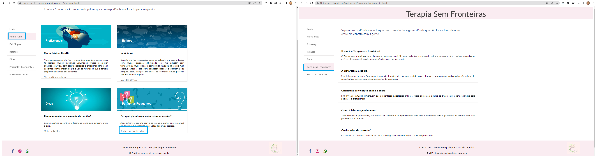

# Registro de Testes de Software

Pré-requisitos: <a href="3-Projeto de Interface.md"> Projeto de Interface</a>, <a href="8-Plano de Testes de Software.md"> Plano de Testes de Software</a>

Relatório com as evidências dos testes de software realizados no sistema pela equipe, baseado em um plano de testes pré-definido.

## Avaliação

Discorra sobre os resultados do teste. Ressaltando pontos fortes e fracos identificados na solução. Comente como o grupo pretende atacar esses pontos nas próximas iterações. Apresente as falhas detectadas e as melhorias geradas a partir dos resultados obtidos nos testes.

> **Links Úteis**:
> - [Ferramentas de Test para Java Script](https://geekflare.com/javascript-unit-testing/)

## CT10 - Cards da Home Page - Dicas

- Resultado obtido: Passou no teste ao clicar em Veja mais dicas e, também ao utilizar o Dicas na aba de navegação esquerda. Há a possibilidade de utilizar javascript para adicionar uma animação ao mover o cursor no card tornando mais interativo e chamativo. 
- Testado por: Larissa

 Teste - Dicas

## CT11 - Cards da Home Page - Perguntas Frequentes

- Resultado obtido: Passou no teste ao clicar em Tenho Outras Dúvidas e, também ao utilizar o Perguntas Frequentes na aba de navegação esquerda. Há a possibilidade de utilizar javascript para adicionar uma animação ao mover o cursor no card tornando mais interativo e chamativo.
- Testado por: Larissa

 Teste - Perguntas Frequentes

## CT12 - Card, Cadastro Psicólogos, Home Page

- Resultado obtido: Passou no teste ao clicar em Ver Perfil Completo e escolher um profissional para ter mais informações. E, também ao utilizar a opção Psicólogos na aba de navegação esquerda. Há a possibilidade de utilizar javascript para adicionar uma animação ao mover o cursor no card tornando mais interativo e chamativo. No perfil do psicólogo, podemos colocar links externos para facilitar o contato do paciente com o psicólogo. 
- Testado por: Larissa

 Teste - Card Psicólogos

## CT13 - Relatos

- Resultado obtido: Passou no teste ao clicar em Mais Relatos. E, também ao utilizar a opção Relatas na aba de navegação esquerda. Há a possibilidade de utilizar javascript para adicionar uma animação ao mover o cursor no card tornando mais interativo e chamativo. O mesmo pode ser feito nos relatos ao serem colocados mais em evidência com animações. 
- Testado por: Larissa

 Teste - Card Relatos 
